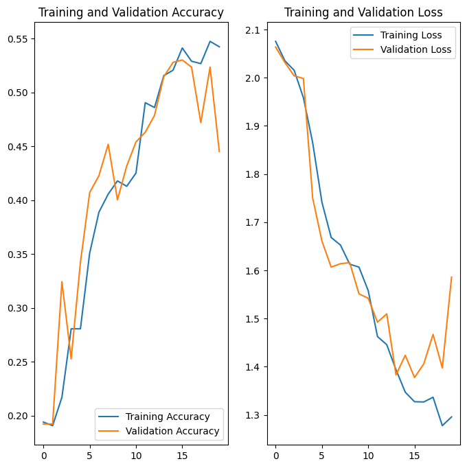
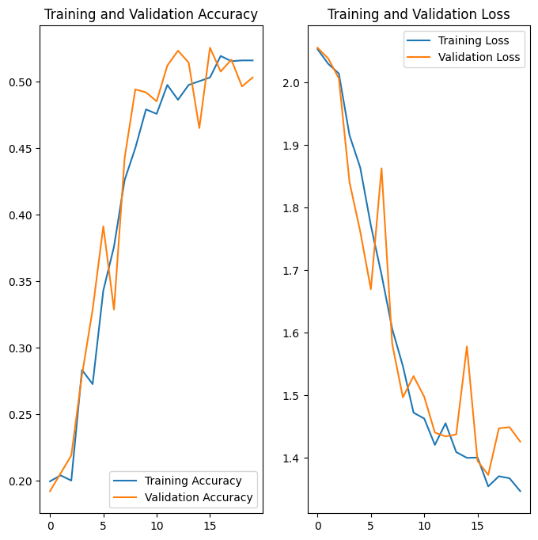
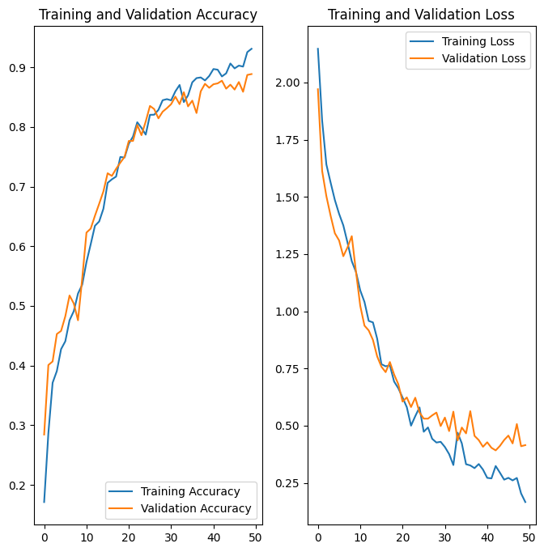

# Melanoma-Detection-using-CNN
> In this project, a specialized CNN is utilized for identifying melanoma within skin lesion images across 10 different categories. A web application for the model's predictions has been crafted using the Gradio library. The model boasts a prediction accuracy of 87%.

## Table of Contents

- [Melanoma-Detection-using-CNN](#melanoma-detection-using-cnn)
  - [Table of Contents](#table-of-contents)
  - [General Information](#general-information)
    - [Algorithms Used](#algorithms-used)
    - [Dataset Information](#dataset-information)
  - [Steps Involved](#steps-involved)
  - [Results](#results)
    - [Baseline Model](#baseline-model)
    - [Augmented Model](#augmented-model)
    - [Final Model](#final-model)
- [Conclusion](#conclusion)
- [Technologies Used](#technologies-used)
- [Contact](#contact)
- [License](#license)

## General Information

### Algorithms Used

CNN - Convolutional Neural Network

### Dataset Information

The dataset is composed of 2,357 images of both malignant and benign skin conditions, compiled by the International Skin Imaging Collaboration (ISIC). The images have been categorized in accordance with ISIC's classification system. While the dataset has been evenly distributed across different classes, there is a slight predominance of images featuring melanomas and moles.

The data contains these images group:

- Actinic keratosis
- Basal cell carcinoma
- Dermatofibroma
- Melanoma
- Nevus
- Pigmented benign keratosis
- Seborrheic keratosis
- Squamous cell carcinoma
- Vascular lesion

## Steps Involved

1/ Importing Skin Cancer Data
2/ Importing all the important libraries
3/ Load using keras.preprocessing
4/ Create a dataset
5/ Visualize the data
6/ Create the model
7/ Compile the model
8/ Train the model
9/ Visualizing training results
10/ Write findings after the model fit, see if there is an evidence of model overfit or underfit
10.1/ Write findings in the step 9
10.2/ Create the model, compile and train the model
10.2.1/ Compiling the model
10.2.2/ Training the model
11/ Visualizing the results
11.1/ Write findings after the model fit, see if there is an evidence of model overfit or underfit. Do you think there is some improvement now as compared to the previous model run?
11.2/ Find the distribution of classes in the training dataset.
11.3/ Write findings in the step 11
11.4/ Rectify the class imbalance
12/ Lets see the distribution of augmented data after adding new images to the original training data.
12.1/ Train the model on the data created using Augmentor
12.2/ Create a training dataset
12.3/ Create a validation dataset
12.4/ Create model (make sure to include normalization)
12.5/ Compile model (Choose optimizer and loss function appropriately)
12.6/ Train model
12.7/ Visualize the model results
12.8/ Analyze results

## Results

### Baseline Model

Accuracy and Loss charts for the baseline model

### Augmented Model

Accuracy and Loss charts for the augmented model

### Final Model

Accuracy and Loss charts for the final model

# Conclusion

- With the improvement in the model's accuracy, there is a corresponding reduction in the loss.
- The ultimate version of the model achieved an accuracy rate of 87% with a loss value standing at 0.3.
- The model demonstrates a strong capability to accurately determine the category of the lesion.
- Enhancing the dataset and addressing the imbalance among classes contributed to the enhancement of the model's accuracy.

# Technologies Used

- Python
- Tensorflow
- Keras
- Augmentor
- Matplotlib
- NumPy

# Contact

Created by [@VMCuongOnGitHub] - feel free to contact me!
